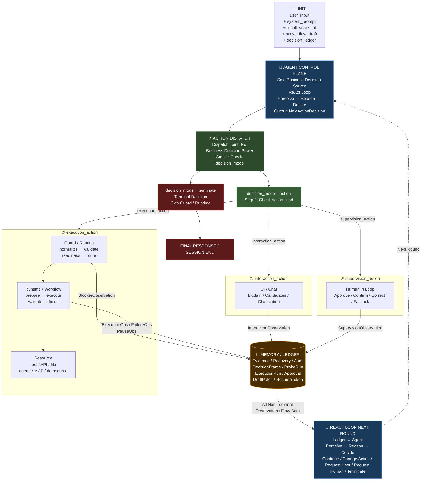
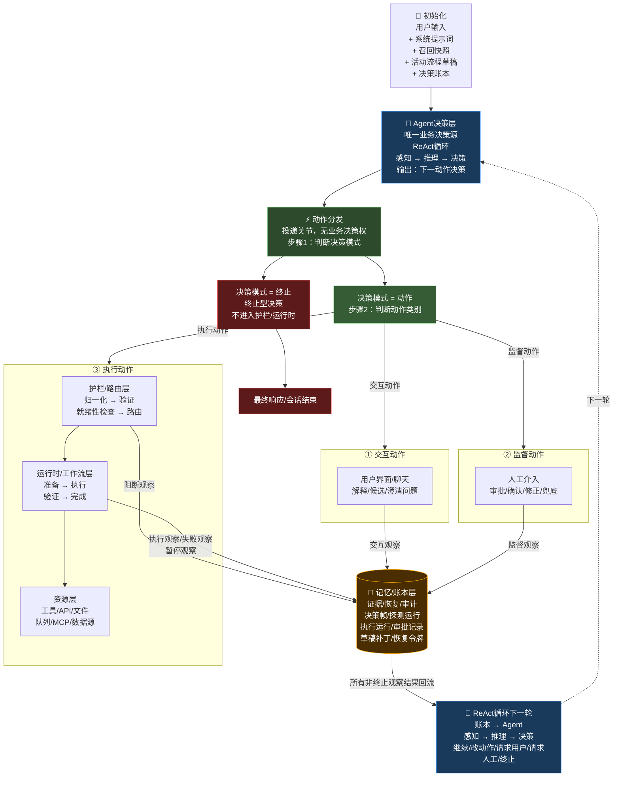

# 智能造数平台架构设计 v7

## 需求背景
现状：我的存量造数平台是一个封装一些列操作，例如http请求其他系统，dubbo服务化调用其他系统，sql操作直接操作其他系统数据。
通过这些操作的封装组合组装出一个造数场景业务，通过http接口暴露出这个造数场景，用户只需要调用接口传入指定参数即可造数。
我现在需要做一个智能造数平台，能够通过ReAct模式智能分析用户需求，智能推导完成用户造数需求，需要操作哪些sql,调用哪些http接口，dubbo服务化接口等。
通过和用户的交互澄清来沉淀出造数场景执行步骤，从而智能造数。

## 1. 唯一控制律（Single Control Law，唯一控制律）

系统任何一轮推进，都必须满足下面这条控制律：

```text
Agent（智能体）决定：现在最值得做什么
Guard（护栏）决定：这件事能不能做、该怎么安全地做
Runtime（运行时）决定：这件事怎样稳定地做完
Resource（资源）负责：真正被调用并返回原始结果
Memory / Ledger（共享记忆 / 账本）负责：记住为什么这样做、做到哪了、结果是什么
Human in Loop（人工介入）负责：在必要时确认、修正、兜底，但不接管主脑
```

如果任何一层越权去决定“下一步业务动作”，系统就会重新退化为：

```text
带聊天壳的工作流引擎
```

---

## 2. ReAct + Human in Loop 主循环图

这一张图定义系统的**唯一业务主循环**。

### 2.0-A ASCII 流程图

```text
  ╔══════════════════════════════════════════════════════════════════╗
  ║ INIT（初始化上下文）                                             ║
  ║ user_input（用户输入）                                           ║
  ║ + system_prompt（系统提示）                                      ║
  ║ + recall_snapshot（召回快照）                                    ║
  ║ + active_flow_draft（活动流程草稿）                              ║
  ║ + decision_ledger（决策账本）                                    ║
  ╚══════════════════════════════╤═══════════════════════════════════╝
                                 │ 读取上下文
                                 ▼
  ╔══════════════════════════════════════════════════════════════════╗
  ║ AGENT CONTROL PLANE（Agent决策层/唯一业务决策源）                ║
  ║ ReAct Loop（推理-行动循环）:                                     ║
  ║   Perceive（感知） → Reason（推理） → Decide（决策）             ║
  ║ 输出 NextActionDecision（下一动作决策）                           ║
  ║ {                                                                ║
  ║   decision_mode（决策模式）: action | terminate,                 ║
  ║   action_kind（动作类别）: interaction|supervision|execution,    ║
  ║   action（动作名）: ask_clarification|probe_step|...,            ║
  ║   params（参数）: {...},                                         ║
  ║   risk（风险级别）: low|medium|high|critical,                    ║
  ║   ...                                                            ║
  ║ }                                                                ║
  ╚══════════════════════════════╤═══════════════════════════════════╝
                                 │
                                 ▼
  ╔══════════════════════════════════════════════════════════════════╗
  ║ ACTION DISPATCH（动作分发/投递关节，无业务决策权）               ║
  ║ Step 1: 先判断 decision_mode（决策模式）                         ║
  ║         = terminate（终止） | action（动作）                     ║
  ╚══════════════════════════════╤═══════════════════════════════════╝
                                 │
                    ┌────────────┴────────────┐
                    │                         │
                    ▼                         ▼
      ┌──────────────────────────┐   ╔══════════════════════════════╗
      │ decision_mode = action   │   ║ decision_mode = terminate    ║
      │ （决策模式 = 动作）        │   ║ （决策模式 = 终止）           ║
      │ Step 2: 再判断 action_kind │   ║ 终止型决策                     ║
      │ （动作类别）               │   ║ 不进入 Guard / Runtime         ║
      └────────────┬─────────────┘   ║ 写 final_status（最终状态）   ║
                   │                 ║    /final_message（最终消息） ║
                   │                 ╚══════════════╤═══════════════╝
                   │                                │
                   │                                ▼
                   │                 ╔══════════════════════════════╗
                   │                 ║ FINAL RESPONSE（最终响应）   ║
                   │                 ║ / SESSION END（会话结束）    ║
                   │                 ╚══════════════════════════════╝
                   │
      ┌────────────┼──────────────────────────────┐
      │            │                              │
      ▼            ▼                              ▼
┌───────────────┐  ┌─────────────────────┐  ┌──────────────────────────┐
│ UI / Chat     │  │ Human in Loop       │  │ execution_action         │
│ （用户界面/聊天）│  │ （人工介入监督通道）  │  │ （执行动作）              │
│ 解释/候选/    │  │ 审批/确认/修正/兜底 │  │                          │
│ 澄清问题      │  │                     │  │ Guard / Routing          │
└───────┬───────┘  └──────────┬──────────┘  │ （护栏/路由层）            │
        │                     │             │ normalize（归一化）        │
        │                     │             │   →validate（验证）       │
        │                     │             │   →readiness（就绪性检查） │
        │                     │             │   →route（路由）          │
        │                     │             │           │              │
        │                     │             │           ▼              │
        │                     │             │ Runtime / Workflow       │
        │                     │             │ （运行时/工作流层）         │
        │                     │             │ prepare（准备）            │
        │                     │             │   →execute（执行）        │
        │                     │             │   →validate（验证）       │
        │                     │             │   →finish（完成）         │
        │                     │             │           │              │
        │                     │             │           ▼              │
        │                     │             │ Resource（资源层）         │
        │                     │             │ tool/API/文件/队列/MCP    │
        │                     │             │ （工具/API/文件/队列/      │
        │                     │             │  模型上下文协议）           │
        │                     │             │ /数据源                  │
        │                     │             └───────────┬──────────────┘
        │                     │                         │
        ▼                     ▼                         ▼
 InteractionObs        SupervisionObs          BlockerObs / ExecutionObs
 （交互观察）           （监督观察）            （阻断观察 / 执行观察）
                                                / FailureObs（失败观察）
                                                / PauseObs（暂停观察）
        └─────────────────────┬────────────────────────────┘
                              │
                              ▼
  ╔══════════════════════════════════════════════════════════════════╗
  ║ MEMORY / LEDGER（记忆/账本层，贯穿全链路的证据/恢复/审计层）     ║
  ║ 写入：                                                            ║
  ║   DecisionFrame（决策帧）                                         ║
  ║   ProbeRun（探测运行） / ProbeFinding（探测发现）                 ║
  ║   ExecutionRun（执行运行） / RunStep（执行步骤）                  ║
  ║   Approval（审批记录）                                            ║
  ║   DraftPatch（草稿补丁）                                          ║
  ║   ResumeToken（恢复令牌）                                         ║
  ║   InteractionRecord（交互记录）                                   ║
  ║   SupervisionRecord（监督记录）                                   ║
  ║   ObservationEnvelope（观察结果外壳）                             ║
  ╚══════════════════════════════╤═══════════════════════════════════╝
                                 │ 所有非终止 Observation（观察结果）
                                 │ 回流给 Agent
                                 ▼
  ╔══════════════════════════════════════════════════════════════════╗
  ║ REACT LOOP NEXT ROUND（ReAct循环下一轮/下一轮推理）              ║
  ║ Ledger（账本）→ Agent（智能体）：                                ║
  ║   重新 Perceive（感知） → Reason（推理） → Decide（决策）        ║
  ║ 判断：继续 / 改动作 / 请求用户 / 请求人工 / 终止                 ║
  ╚══════════════════════════════╤═══════════════════════════════════╝
                                 │
                                 └────────────────────────────▶
                                   回到 AGENT CONTROL PLANE
                                   （回到Agent决策层/唯一业务决策源）
```

> 💡 关键：三条动作路径（interaction / supervision / execution）是 Agent **每轮重新选择**的结果，
> 不是固定的流程阶段顺序。`terminate` 不是第四种 `action_kind`，而是 `decision_mode = terminate` 的结束出口。所有**非终止 Observation**都必须经 Ledger 回流给 Agent。

---

### 2.0-B Mermaid 流程图

#### 🇺🇸 English Version



#### 🇨🇳 中文版



### 2.1 这张图必须表达的结论

- `ReAct Loop（推理-行动循环）` 只存在于 `Agent Control Plane（Agent 决策层）`
- `Action Dispatch（动作分发）` 只是投递关节，不是流程控制器
- `Human in Loop（人工介入）` 是监督通道，不是新主脑
- `Guard / Runtime / Resource` 只处理 `execution_action（系统执行动作）`
- 所有结果都必须回流到 `Agent`，由 `Agent` 再决定下一步

### 2.2 动作类别不是流程阶段

下面这种理解是错的：

```text
先 interaction_action
再 execution_action
最后 supervision_action
```

这会重新退化成 workflow（工作流）阶段机。

正确理解必须是：

```text
每一轮都由 Agent 基于当前证据重新选择：
这一次应该投递到 interaction_action / execution_action / supervision_action 中的哪一类
```

因此：

- 命中高置信历史模板时，可能直接进入 `execution_action`
- 召回命中不准时，可能先进入 `interaction_action`
- 高风险动作时，可能先进入 `supervision_action`

---

## 3. 五层架构总图（4+1 Planes，四加一分层）

这一张图定义系统的**长期静态结构**。

```text
                    ┌──────────────────────────────────────────────┐
                    │ Memory / Ledger Plane                        │
                    │（共享记忆 / 账本层，贯穿前四层）             │
                    │ FlowDraft / DecisionFrame / RecallSnapshot   │
                    │ ProbeRun / ExecutionRun / Approval           │
                    └───────┬──────────────────────────────────────┘
                            │ 读 / 写证据
                            │
                            ▼
                  ┌──────────────────────────────────┐
                  │ Agent Control Plane              │
                  │（Agent 决策层，唯一业务决策源） │
                  └─────────────────┬────────────────┘
                                    │
                                    ▼
                  ┌──────────────────────────────────┐
                  │ Guard / Routing Plane            │
                  │（路由护栏层）                    │
                  └─────────────────┬────────────────┘
                                    │
                                    ▼
                  ┌──────────────────────────────────┐
                  │ Runtime / Workflow Plane         │
                  │（标准化执行层）                  │
                  └─────────────────┬────────────────┘
                                    │
                                    ▼
                  ┌──────────────────────────────────┐
                  │ Resource Plane                   │
                  │（资源层）                        │
                  └──────────────────────────────────┘

┌──────────────────────┐                                ┌──────────────────────┐
│ User / UI Channel    │ <──── 只与 Agent 交互 ────>   │ Human in Loop Channel │
│（用户 / 界面通道）   │                                │（人工介入监督通道）   │
└──────────────────────┘                                └──────────────────────┘
```

> 💡 图例说明：
>
> - 五层架构只有：`Agent / Guard / Runtime / Resource / Memory`
> - `User / UI Channel` 和 `Human in Loop Channel` 是**通道（Channel）**，不是新的平面（Plane）
> - `Memory / Ledger Plane` 不是排在最上游或最下游的串行层，而是贯穿前四层的共享状态平面
> - 图中只画主干结构，实际 `Memory / Ledger Plane` 与 `Agent / Guard / Runtime / Resource` 都存在读写关系

### 3.1 五层的真实含义

1. `Agent Control Plane（Agent 决策层）`
   - 唯一业务决策源

2. `Guard / Routing Plane（路由护栏层）`
   - 合法性、就绪性、风险、执行通道裁决

3. `Runtime / Workflow Plane（标准化执行层）`
   - 单动作稳定执行、暂停恢复、重试超时、幂等控制

4. `Resource Plane（资源层）`
   - 提供工具、接口、文件、队列、MCP、数据源等真实能力

5. `Memory / Ledger Plane（共享记忆 / 账本层）`
   - 不是串行最后一层，而是贯穿全链路的共享状态平面
   - 它与前四层都是“读 / 写证据”的关系，不是“指挥 / 被指挥”的关系

### 3.2 两条辅助通道的定位

- `User / UI Channel（用户 / 界面通道）`
  - 用来承接解释、澄清、候选展示、用户确认
  - 只与 `Agent Control Plane` 发生产品语义交互，不应直接接管 Guard / Runtime

- `Human in Loop Channel（人工介入监督通道）`
  - 用来承接审批、人工确认、人工修正、人工兜底
  - 是监督通道，不是第六控制平面

这两条通道都不是新的控制平面。它们只是 `Agent` 的外部交互对象。

---

## 4. 核心契约（Core Contracts，核心契约）

如果没有结构化契约，后面一定会重新退化成“靠字符串和状态机猜意图”。

### 4.1 NextActionDecision（下一动作决策）

`Agent` 每一轮必须输出统一契约，而不是自由文本。

```json
{
  "decision_mode": "action",
  "action_kind": "interaction_action",
  "action": "ask_clarification",
  "reasoning": "召回命中了相似模板，但环境和对象范围仍不确定",
  "goal_delta": "确认这次是否复用历史订单模板",
  "params": {
    "questions": [
      "这次还是 UAT 环境吗？",
      "是否沿用上次订单模板？"
    ]
  },
  "expected": {
    "type": "user_answer",
    "signals": ["env_confirmed", "reuse_strategy_confirmed"]
  },
  "risk_level": "low",
  "requires_approval": false,
  "user_visible": {
    "title": "我需要先确认两点",
    "summary": "当前历史命中可能不完全准确。"
  },
  "final_status": null,
  "final_message": null
}
```

这里必须明确两种决策模式：

1. `decision_mode = action`
   - 表示进入正常动作分发
   - 继续走 `interaction_action / execution_action / supervision_action`

2. `decision_mode = terminate`
   - 表示这是 Agent 做出的终止型决策
   - `Action Dispatch` 只负责短路后续动作层
   - 直接把最终结论写入 `Memory / Ledger`

终止型决策建议写成：

```json
{
  "decision_mode": "terminate",
  "action_kind": null,
  "action": null,
  "reasoning": "当前目标已经完成，不需要继续动作分发",
  "goal_delta": "结束当前任务并返回最终结果",
  "params": {},
  "expected": {
    "type": "task_finish"
  },
  "risk_level": "none",
  "requires_approval": false,
  "user_visible": {
    "title": "任务完成",
    "summary": "本轮无需继续执行动作。"
  },
  "final_status": "completed",
  "final_message": "任务已完成，当前轮次不再继续动作分发"
}
```

这条设计的关键不是“给 Dispatch 终止权”，而是：

- **终止仍然是 Agent 决策**
- `Action Dispatch` 只负责识别“这是终止型决策”，然后短路
- `Guard / Runtime / Resource` 不参与终止判断

### 4.2 GuardVerdict（护栏裁决结果）

只有 `execution_action` 才进入这一层。

```json
{
  "allowed": true,
  "normalized_action": "probe_step",
  "route": "runtime_probe",
  "blockers": [],
  "approval_required": false,
  "readiness_snapshot": {
    "resource_ready": true,
    "contract_ready": false
  }
}
```

### 4.3 Observation（观察结果）

任何通道的结果都必须回流成 Observation，而不是一句散乱文本。

系统至少需要下面六类：

1. `InteractionObservation（交互观察）`
2. `BlockerObservation（阻断观察）`
3. `ExecutionObservation（执行完成观察）`
4. `FailureObservation（失败观察）`
5. `PauseObservation（暂停观察）`
6. `SupervisionObservation（监督观察）`

为了便于账本统一存储和 Agent 统一解析，Observation 不建议做成完全分裂的多套结构，而应该采用：

```text
统一外壳（Common Envelope）
+ 分类载荷（Typed Payload）
```

统一外壳建议至少包含：

```json
{
  "observation_type": "interaction|blocker|execution|failure|pause|supervision",
  "action_kind": "interaction_action|execution_action|supervision_action|null",
  "action": "xxx",
  "status": "success|fail|pending|confirmed|blocked|paused",
  "actor": {
    "type": "user|human|system",
    "id": "optional"
  },
  "timestamp": "2026-03-30T12:00:00Z",
  "result": {
    "summary": "面向 Agent 的结果摘要"
  },
  "error": null,
  "evidence": [],
  "payload": {}
}
```

这样设计的原因是：

- `interaction`、`execution`、`supervision` 可以统一入账
- Agent 解析时先读统一外壳，再按 `payload` 做细分理解
- 不会因为每类 Observation 结构完全不同，导致后面又靠条件分支硬猜

例如交互观察：

```json
{
  "observation_type": "interaction",
  "action_kind": "interaction_action",
  "action": "ask_clarification",
  "status": "confirmed",
  "actor": {"type": "user"},
  "timestamp": "2026-03-30T12:00:00Z",
  "result": {
    "summary": "用户确认这次不复用历史模板"
  },
  "error": null,
  "evidence": ["chat_message_id:123"],
  "payload": {
    "answers": {
      "reuse_template": false
    }
  }
}
```

例如监督观察：

```json
{
  "observation_type": "supervision",
  "action_kind": "supervision_action",
  "action": "request_human_confirm",
  "status": "confirmed",
  "actor": {"type": "human", "id": "alice"},
  "timestamp": "2026-03-30T12:05:00Z",
  "result": {
    "summary": "人工确认允许继续执行"
  },
  "error": null,
  "evidence": ["approval_id:appr_001"],
  "payload": {
    "approval_id": "appr_001"
  }
}
```

例如执行观察：

```json
{
  "observation_type": "execution",
  "action_kind": "execution_action",
  "action": "probe_step",
  "status": "success",
  "actor": {"type": "system"},
  "timestamp": "2026-03-30T12:08:00Z",
  "result": {
    "summary": "关键步骤探测成功，必填参数已齐备"
  },
  "error": null,
  "evidence": ["probe_log:run_123", "trace_id:abc"],
  "payload": {
    "step_key": "create_user",
    "expected_matched": true,
    "resume_token": null
  }
}
```

### 4.4 决策可见性规则

- 系统内部看 `NextActionDecision`
- 用户界面默认看 `user_visible`
- 调试台可以看原始 JSON
- 任何层都不允许让用户直接理解底层状态机字段

### 4.5 Action Dispatch（动作分发）的终止短路规则

`Action Dispatch` 必须先判断 `decision_mode`：

```text
if decision_mode == terminate
  -> 直接写入 final_status / final_message
  -> 生成终止事件
  -> 返回用户最终结果
else
  -> 再进入 action_kind 分发
```

这里的边界必须非常清楚：

- `Action Dispatch` 可以短路执行链
- `Action Dispatch` 不能自己判断“该不该终止”
- 是否终止，永远来自 `Agent Control Plane`

---

## 5. Agent Control Plane（Agent 决策层）

### 5.1 负责什么

- 理解用户目标
- 汇总上下文、召回、历史记忆、当前草稿、执行证据
- 建立或修订任务假设
- 选择下一最优动作
- 决定是解释、澄清、验证、审批、执行还是终止
- 决定是否调用专业规划能力

### 5.2 Agent 如何与其他层交互

```text
读：
Memory / Ledger 提供的统一上下文视图

写：
NextActionDecision

收：
InteractionObservation / BlockerObservation / ExecutionObservation
/ FailureObservation / PauseObservation / SupervisionObservation
```

### 5.3 职责边界

这一层只回答：

- 用户到底想完成什么
- 当前理解是否成立
- 下一步最值得做什么

这一层不负责：

- 资源可用性判定
- 合规校验
- 稳定执行细节
- 工具调用重试

### 5.4 约束条件

- 必须先读 `Memory / Ledger`
- 必须输出结构化决策
- 每一轮都必须重新决策，不允许沿用“预设固定阶段”
- 用户新输入和执行新结果都必须重新进入 ReAct

### 5.5 不能做什么

- 不能把 `draft.status` 当成业务脚本
- 不能把 `execution_path` 当成固定主入口
- 不能把 `Human in Loop` 当成总控器
- 不能把多 Agent 编排默认当主脑

---

## 6. Guard / Routing Plane（路由护栏层）

### 6.1 负责什么

- 动作归一化
- 参数完整性检查
- 动作合法性校验
- 风险级别判断
- 权限与资源准入检查
- 执行通道路由

### 6.2 Agent 如何与本层交互

```text
Agent -> Guard:
  仅发送 execution_action

Guard -> Agent:
  返回 GuardVerdict
  或返回 BlockerObservation
```

### 6.3 职责边界

这一层只回答：

- 这个动作是否合法
- 这个动作现在能不能执行
- 这个动作该走哪条执行通道

这一层绝不回答：

- 用户真正要什么
- 下一最优动作是什么
- 如果当前动作不通，业务上应该改成什么

### 6.4 约束条件

- 必须尽量纯规则化、配置化
- 允许阻断，不允许改写业务目标
- 允许要求审批，不允许替 Agent 决定后续动作
- 规则输出必须结构化

### 6.5 不能做什么

- 不能把 `ReadinessGate` 变成主流程推进器
- 不能把 `ActionRouter` 变成业务编排器
- 不能根据 `status` 自动推进到 execute
- 不能替用户补业务意图

---

## 7. Runtime / Workflow Plane（标准化执行层）

### 7.1 负责什么

- 单动作执行准备
- 原子动作执行
- compiled contract（编译后执行契约）执行
- retry / timeout / idempotency（重试 / 超时 / 幂等）
- pause / resume（暂停 / 恢复）
- 结构化结果回传

### 7.2 Agent 如何与本层交互

```text
Agent 不直接与 Runtime 讨论“业务下一步”

Agent -> Guard -> Runtime:
  发送已批准执行的 execution_action

Runtime -> Agent:
  只返回执行证据
  不返回“我替你决定下一步怎么做”
```

### 7.3 职责边界

这一层只负责：

- 把一个动作稳定做完
- 在单动作内部维护技术状态机

这一层不负责：

- 串联任务级主流程
- 选择下一业务动作
- 根据异常自动改目标

### 7.4 合法的状态机边界

只允许存在于单动作内部，例如：

```text
queued -> running -> retrying -> succeeded
running -> paused -> resumed -> completed
running -> timeout -> failed
```

这是技术执行状态机，合法。

### 7.5 不能做什么

- 不能把 pause / resume 扩展成业务主流程状态机
- 不能让 Workflow 自己决定“下一步去 probe / execute / ask_user”
- 不能在失败后偷偷切换到另一条业务路径

---

## 8. Resource Plane（资源层）

### 8.1 负责什么

- tool（工具）
- API（接口）
- 文件系统
- 队列和 worker
- MCP
- SQL / HTTP / Dubbo / 浏览器 / 数据源
- 模板、资产、catalog、召回资源

### 8.2 Agent 如何与本层交互

`Agent` 不应该直接面向资源做业务编排。

正常路径必须是：

```text
Agent -> Guard -> Runtime -> Resource
```

### 8.3 职责边界

这一层只回答：

- 我能不能被调用
- 如何被调用
- 调用结果是什么

这一层绝不回答：

- 为什么现在要调用我
- 调用我之后下一步该干什么

### 8.4 约束条件

- 资源能力要标准化暴露
- 返回值必须结构化
- 底层异常必须保留诊断信息
- 不能在资源层偷偷做业务 fallback

### 8.5 不能做什么

- 不能做主流程判断
- 不能自己决定下一步调用谁
- 不能把 prompt 拼装逻辑藏成资源入口

---

## 9. Memory / Ledger Plane（共享记忆 / 账本层）

### 9.1 负责什么

- 工作记忆
- 决策账本
- 召回账本
- probe 账本
- execution 账本
- approval 账本
- continuation / resume 恢复依据

### 9.2 关键对象

- `FlowDraft（流程草稿 / 工作记忆草稿）`
- `DecisionFrame（决策帧）`
- `RecallSnapshot（召回快照）`
- `ProbeRun / ProbeFinding（试探运行 / 试探发现）`
- `ExecutionRun / RunStep（执行运行 / 执行步骤）`
- `Approval（审批记录）`

### 9.3 Agent 如何与本层交互

```text
Agent 在每次决策前读取：
  当前最可信的统一上下文视图

各层在完成动作后写入：
  新证据、新结果、新风险、新恢复依据
```

### 9.4 职责边界

这一层必须是：

- 证据平面
- 恢复平面
- 审计平面

这一层不能是：

- 主流程控制器
- 状态机脚本引擎
- 隐式业务编排器

### 9.5 约束条件

- `FlowDraft` 必须逐步成为唯一工作记忆核心
- `DecisionFrame` 必须记录“为什么这样决策”
- 状态字段只能是投影，不能单独驱动主流程
- 写入失败只能返回冲突 / 失败 Observation

### 9.6 不能做什么

- 不能出现 `if draft.status == probe_ready then must_probe`
- 不能出现 `if session.state == clarifying then only_ask_user`
- 不能出现 `if execution_path == template_direct then direct_execute`

---

## 10. User / UI Channel（用户 / 界面通道）

这不是新平面，但它必须被单独定义，否则产品交互会重新塌缩回“工作流表单”。

### 10.1 负责什么

- 呈现 `user_visible`
- 展示当前理解、依据、候选、风险、下一步建议
- 收集用户澄清、确认、拒绝、补充信息

### 10.2 Agent 如何与用户交互

用户不应该直接看到内部状态机或底层 JSON。

默认应看到：

- 当前理解
- 判断依据
- 当前阻塞 / 风险
- 下一步建议

### 10.3 不能做什么

- 不能把用户交互强制写成固定问卷流
- 不能把聊天回复降级成“状态机提示词”
- 不能把所有交互都默认塞回 execution_action

---

## 11. Human in Loop Channel（人工介入监督通道）

这也不是新平面，而是监督通道。

### 11.1 负责什么

- 高风险动作确认
- 审批接入
- 人工修正参数
- 人工终止任务
- 人工兜底执行

### 11.2 Agent 如何与人工交互

```text
Agent 决定是否发起 supervision_action
Human in Loop 返回结构化结果
结果写入 Memory / Ledger
Agent 再决定下一步
```

### 11.3 不能做什么

- 不能成为新的总控编排器
- 不能接管 Agent 主脑
- 不能产生“人工阶段 -> 自动阶段 -> 人工阶段”的固定流程脚本

---

## 12. 关键交互流程（Key Interaction Flows，关键交互流程）

### 12.1 场景 A：召回命中不准，先走交互

```text
初始化上下文
  -> Agent 判断：历史命中可能不准
  -> interaction_action.ask_clarification
  -> 用户回复
  -> InteractionObservation 回写
  -> Agent 重新决策
```

这里的关键点是：

- 召回命中只是证据，不是真相
- 命中错了时，必须先回交互，不要硬闯执行

### 12.2 场景 B：信息足够，走执行验证

```text
Agent 决策：execution_action.probe_step
  -> Guard 校验
  -> Runtime 执行
  -> Resource 被调用
  -> ExecutionObservation / FailureObservation 回流
  -> Agent 再判断
```

### 12.3 场景 C：高风险动作，进入监督通道

```text
Agent 决策：supervision_action.request_human_confirm
  -> Human in Loop
  -> 人工确认 / 修改 / 终止 / 手动执行
  -> SupervisionObservation 回流
  -> Agent 再决策
```

### 12.4 场景 D：复杂状态流转怎么办

答案必须固定：

```text
复杂状态允许存在
但只能存在于单动作内部技术执行层
不能上升为任务级业务主流程控制器
```

也就是说：

- 可以有执行状态机
- 可以有暂停恢复状态
- 可以有账本投影状态
- 不能有跨动作业务状态机接管主脑

### 12.5 场景 E：任务完成，触发终止型决策

```text
Agent 判断：当前目标已经完成
  -> 输出 decision_mode = terminate
  -> Action Dispatch 识别终止型决策
  -> 不再进入 Guard / Runtime / Resource
  -> Memory / Ledger 写入 final_status / final_message
  -> 返回最终结果给用户
```

这里的关键点是：

- 终止是 Agent 做出的业务决策
- Dispatch 只是短路，不拥有终止判断权
- 终止结果也必须入账，便于恢复、审计、复盘

---

## 13. 全局约束（Global Constraints，全局约束）

### 13.1 决策唯一源约束

只有 `Agent Control Plane` 能决定下一业务动作。

### 13.2 状态只读约束

所有状态都只能作为证据输入，不能作为业务脚本。

### 13.3 Workflow 动作级约束

`Workflow` 只能执行单动作或执行契约，不能拥有任务级编排权。

### 13.4 Guard 纯裁决约束

`Guard` 可以阻断，可以给 route，不可以改目标，不可以补决策。

### 13.5 Human in Loop 监督约束

人工介入只能做确认、修正、兜底，不能接管主脑。

### 13.6 Ledger 非控制器约束

账本必须持久化，但绝不能成为隐藏的状态机脚本引擎。

---


## 名词解释补充

### decision_ledger
  decision_ledger 是 Memory / Ledger Plane（共享记忆/账本层）的关键组成部分，用于：


  ┌──────────┬───────────────────────────────────────────────────────────────────┐
  │ 职责     │ 说明                                                              │
  ├──────────┼───────────────────────────────────────────────────────────────────┤
  │ 证据存储 │ 记录 Agent 每一轮的 DecisionFrame（决策帧），包括"为什么这样决策" │
  │ 恢复支持 │ 会话中断后可从账本恢复决策上下文，继续执行                        │
  │ 审计追溯 │ 所有决策都有据可查，支持事后复盘                                  │
  └──────────┴───────────────────────────────────────────────────────────────────┘

  在流程中的位置

  从文档的流程图可以看到，初始化时：

   INIT（初始化上下文）
   ├── user_input
   ├── system_prompt
   ├── recall_snapshot        # 召回快照
   ├── active_flow_draft      # 活动流程草稿
   └── decision_ledger        # 决策账本 ← 这里

  与其他账本对象的关系

  账本层包含多个关键对象：

   - FlowDraft - 流程草稿/工作记忆草稿
   - DecisionFrame - 决策帧（decision_ledger 记录的核心内容）
   - RecallSnapshot - 召回快照
   - ProbeRun - 试探运行
   - ExecutionRun - 执行运行
   - Approval - 审批记录

  设计约束

  文档强调账本的约束：

  > 账本必须持久化，但绝不能成为隐藏的状态机脚本引擎。

✦ 也就是说：decision_ledger 是证据平面，记录"做了什么决策、为什么"，但不能用它来驱动业务流程——业务决策权始终只在 Agent Control
  Plane。